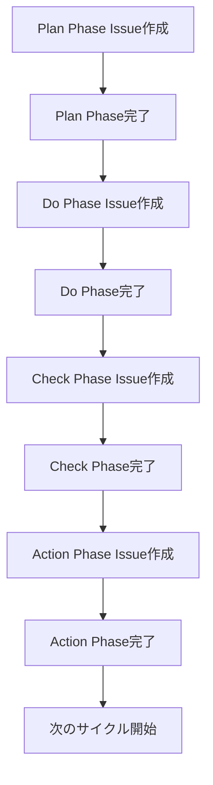
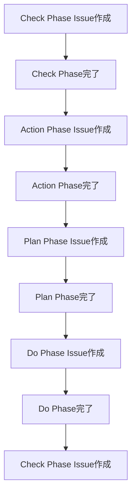

# GitHub IssueベースのPDCA工程管理

## 概要

Personal CRMプロジェクトでは、CursorのAIが意図していない設計やコードにならないように、PDCAサイクルを回す仕様駆動開発を取り入れています。この工程管理はGitHub Issueで行い、各フェーズの成果物を明確に管理します。

## PDCAサイクル

### 1. Plan Phase - 機能定義・方針設定
**目的**: 機能の要件を明確に定義し、実装方針を決定する

**成果物**:
- 機能概要・目標の明確化
- 要件定義（機能要件・非機能要件）
- UI/UX設計
- テストケース定義
- 受け入れ基準の設定

**テンプレート**: `.github/ISSUE_TEMPLATE/plan-phase.md`

### 2. Do Phase - 実装・テスト
**目的**: Plan Phaseで定義した内容を実装し、テストを行う

**成果物**:
- 実装されたコード
- テストコード
- 実装ログ
- コードレビュー結果

**テンプレート**: `.github/ISSUE_TEMPLATE/do-phase.md`

### 3. Check Phase - 検証・評価
**目的**: 実装された機能が計画通りに動作するか検証し、品質を評価する

**成果物**:
- 機能検証結果
- テスト結果
- 品質評価
- 計画との比較
- 課題の特定

**テンプレート**: `.github/ISSUE_TEMPLATE/check-phase.md`

### 4. Action Phase - 改善・最適化
**目的**: Check Phaseで発見された課題を改善し、次のサイクルに活かす

**成果物**:
- 改善アクション
- ルール・プロセス改善
- 次のサイクルへの提案
- 知見・ノウハウの記録

**テンプレート**: `.github/ISSUE_TEMPLATE/action-phase.md`

## ワークフロー

### 1. 新機能開発の場合



### 2. 既存機能改善の場合



## Issue管理

### ラベル体系

#### フェーズラベル
- `plan-phase`: Plan Phase用
- `do-phase`: Do Phase用
- `check-phase`: Check Phase用
- `action-phase`: Action Phase用

#### タイプラベル
- `enhancement`: 新機能
- `implementation`: 実装
- `verification`: 検証
- `improvement`: 改善

#### 優先度ラベル
- `priority-high`: 高優先度
- `priority-medium`: 中優先度
- `priority-low`: 低優先度

### Issue間の関連付け

各フェーズのIssueは、以下の形式で関連付けます：

```
Plan Issue: #123
Do Issue: #124
Check Issue: #125
Action Issue: #126
```

## 実装例

### 例: コンタクトカード機能の開発

#### 1. Plan Phase (#123)
- 機能概要: 新着コンタクトをカード形式で表示
- 要件定義: カード表示、Flip機能、アクションボタン
- UI/UX設計: カードデザイン、アニメーション
- テストケース: 表示テスト、Flipテスト、アクションテスト

#### 2. Do Phase (#124)
- 実装タスク: ContactCard.tsx、FlipAnimation、ActionButtons
- 実装順序: 基本カード → Flip機能 → アクションボタン
- テスト実装: 単体テスト、結合テスト

#### 3. Check Phase (#125)
- 機能検証: カード表示✅、Flip機能✅、アクションボタン✅
- 品質評価: 可読性✅、保守性✅、パフォーマンス✅
- 課題: アニメーションのパフォーマンス改善が必要

#### 4. Action Phase (#126)
- 改善アクション: アニメーション最適化
- ルール更新: アニメーション実装ガイドライン追加
- 次のサイクル: スワイプアウトアニメーション機能

## ベストプラクティス

### 1. Plan Phase
- 要件は具体的に記述する
- 受け入れ基準を明確に定義する
- 関連する既存機能を確認する

### 2. Do Phase
- 実装ログを詳細に記録する
- 設計変更があれば理由を明記する
- コードレビューポイントを明確にする

### 3. Check Phase
- 客観的な評価を行う
- 課題は影響度とともに記録する
- 改善提案は具体的に記述する

### 4. Action Phase
- 改善アクションに期限を設定する
- 知見・ノウハウを記録する
- 次のサイクルへの提案を行う

## 注意事項

### 1. Issue作成時の注意点
- テンプレートを必ず使用する
- 関連Issueを適切にリンクする
- ラベルを適切に設定する

### 2. フェーズ移行時の注意点
- 前のフェーズが完了してから次に移行する
- 完了チェックリストを確認する
- 関連Issueを更新する

### 3. 品質管理
- 各フェーズの成果物を確認する
- 受け入れ基準を満たしているか確認する
- コードレビューを必ず実施する

## トラブルシューティング

### よくある問題

#### 1. 要件が不明確
**問題**: Plan Phaseで要件が不明確
**解決策**: 具体例を追加し、受け入れ基準を明確化

#### 2. 実装が計画と異なる
**問題**: Do Phaseで実装が計画と異なる
**解決策**: 設計変更の理由を記録し、Plan Phaseを更新

#### 3. 検証が不十分
**問題**: Check Phaseで検証が不十分
**解決策**: テストケースを追加し、検証項目を明確化

#### 4. 改善が実行されない
**問題**: Action Phaseで改善が実行されない
**解決策**: 改善アクションに期限を設定し、優先度を明確化

## 参考資料

- [GitHub Issue Templates](https://docs.github.com/en/communities/using-templates-to-encourage-useful-issues-and-pull-requests/configuring-issue-templates-for-your-repository)
- [PDCAサイクル](https://ja.wikipedia.org/wiki/PDCA%E3%82%B5%E3%82%A4%E3%82%AF%E3%83%AB)
- [仕様駆動開発](https://ja.wikipedia.org/wiki/%E4%BB%95%E6%A7%98%E9%A7%86%E5%8B%95%E9%96%8B%E7%99%BA)
